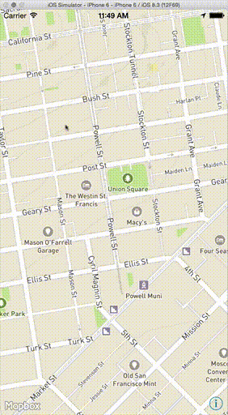

# MBDrawingView.swift

A small `UIView` subclass that can take a configurable stroke color and line width, be drawn on with touch gestures, and upon finger lift, send the array of points drawn to a delegate. 

